# JIRA Tool: User Guide

Welcome to the JIRA Tool user guide! This document explains how to use our API endpoints to supercharge your JIRA workflow with AI-powered features.

## Table of Contents
- [Introduction](#introduction)
- [System Overview](#system-overview)
- [Core Workflows](#core-workflows)
  - [Breaking Down Epics](#breaking-down-epics)
  - [Generating JIRA Ticket Descriptions](#generating-jira-ticket-descriptions)
  - [Analyzing Ticket Complexity](#analyzing-ticket-complexity)
  - [Designing Architecture](#designing-architecture)
  - [Revising Plans](#revising-plans)
- [Basic JIRA Operations](#basic-jira-operations)
- [Advanced Features](#advanced-features)
- [API Reference](#api-reference)

## Introduction

This JIRA Tool provides an intelligent layer on top of your JIRA instance, enabling you to:

- Break down epics into well-structured stories and tasks
- Generate detailed ticket descriptions
- Analyze ticket complexity
- Design architecture with diagrams
- Revise plans with AI assistance
- Create and link tickets automatically in JIRA

Our system uses AI to understand your requirements and create comprehensive, structured plans that can be directly added to your JIRA instance.

## System Overview

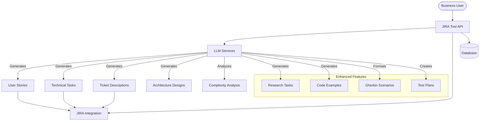

## Core Workflows

### Breaking Down Epics

One of the most powerful features is the ability to break down epics into manageable stories and tasks.

#### Epic Breakdown Sequence

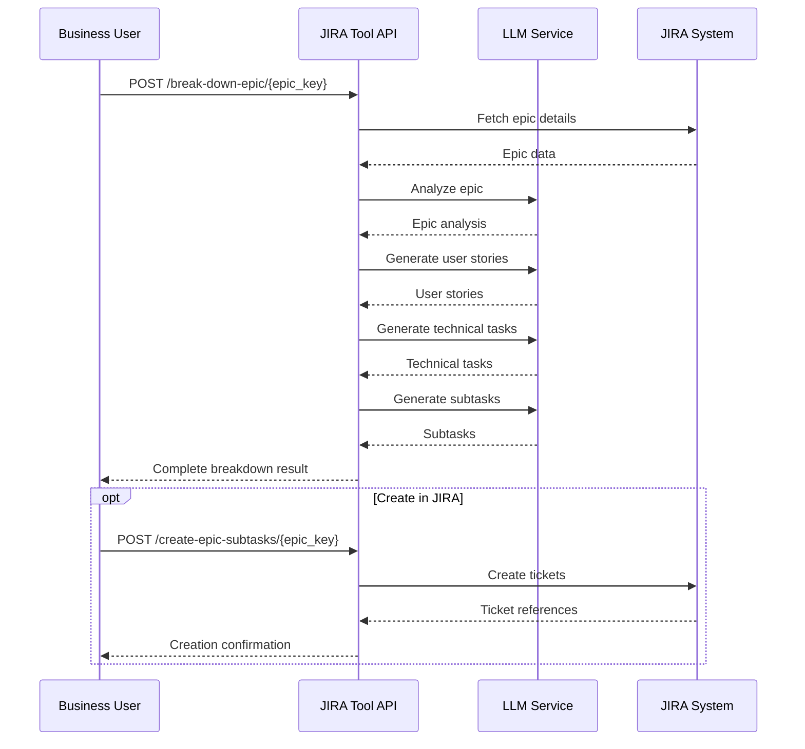

#### Step-by-Step Guide: Breaking Down an Epic

1. **Analyze the Epic**
   - Endpoint: `POST /break-down-epic/{epic_key}`
   - This will generate a breakdown without creating tickets in JIRA
   - Example:
     ```
     curl -X POST "http://your-server/break-down-epic/PROJ-123" \
       -H "Content-Type: application/json"
     ```

2. **Review the Breakdown**
   - The response includes user stories, technical tasks, and subtasks
   - Each item includes a title, description, and acceptance criteria

3. **Create in JIRA (Optional)**
   - Endpoint: `POST /create-epic-subtasks/{epic_key}`
   - This creates all the tickets in JIRA and links them to the epic
   - Example:
     ```
     curl -X POST "http://your-server/create-epic-subtasks/PROJ-123?create_in_jira=true" \
       -H "Content-Type: application/json"
     ```

4. **Customizing the Breakdown**
   - Use query parameters to enable/disable specific features:
     - `enable_code_block_generation`: Generates example code snippets
     - `enable_gherkin_scenarios`: Formats acceptance criteria as Gherkin scenarios
     - `enable_research_tasks`: Identifies research needed before implementation
     - `enable_implementation_approach`: Suggests implementation strategies
     - `enable_test_plans`: Generates test plans for each story

### Generating JIRA Ticket Descriptions

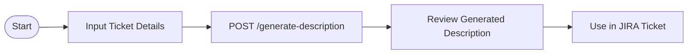

#### Step-by-Step Guide:

1. **Prepare Ticket Information**
   - Gather the basic information about your ticket 

2. **Generate Description**
   - Endpoint: `POST /generate-description/`
   - Payload:
     ```json
     {
       "title": "Implement user authentication system",
       "type": "Story",
       "context": "We need to add secure authentication to our web application"
     }
     ```

3. **Review and Use**
   - The response includes a structured description ready to paste into JIRA

### Analyzing Ticket Complexity

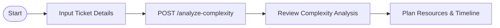

#### Step-by-Step Guide:

1. **Submit Ticket for Analysis**
   - Endpoint: `POST /analyze-complexity/`
   - Payload:
     ```json
     {
       "ticket_key": "PROJ-123",
       "description": "Implement user authentication system",
       "additional_context": "This should include OAuth integration with Google and Facebook"
     }
     ```

2. **Review Complexity Metrics**
   - The response provides complexity scores and effort estimates
   - Use this information for sprint planning and resource allocation

### Designing Architecture

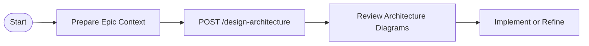

#### Step-by-Step Guide:

1. **Submit Epic for Architecture Design**
   - Endpoint: `POST /design-architecture/`
   - Parameters:
     - `epic_key`: The JIRA key of your epic
     - `cloud_provider`: Your target cloud provider (e.g., "AWS", "Azure")
     - `additional_context`: Any specific requirements or constraints

2. **Review Architecture Design**
   - The response includes:
     - System architecture diagram (Mermaid)
     - Component interactions
     - Data flow diagrams
     - Deployment models
     - Technical recommendations

### Revising Plans

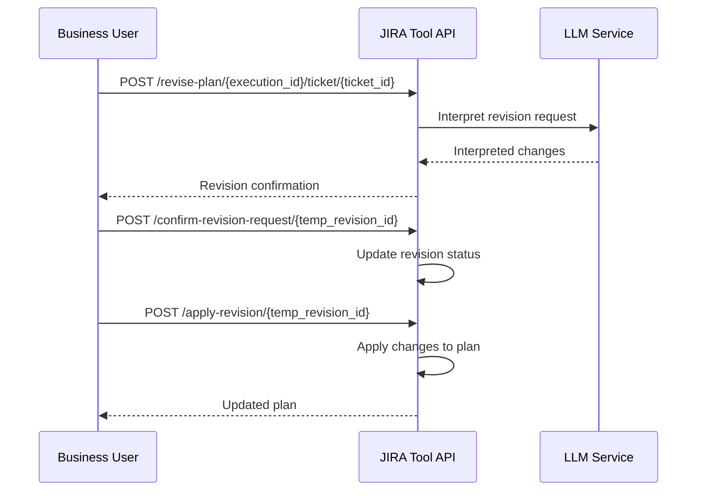

#### Step-by-Step Guide:

1. **Request a Revision**
   - Endpoint: `POST /revise-plan/{execution_id}/ticket/{ticket_id}`
   - Payload:
     ```json
     {
       "revision_text": "Please add more details about data validation requirements"
     }
     ```

2. **Confirm the Revision Request**
   - Endpoint: `POST /confirm-revision-request/{temp_revision_id}`
   - Parameter:
     - `accept`: Whether to accept or reject the revision (default: true)

3. **Apply the Revision**
   - Endpoint: `POST /apply-revision/{temp_revision_id}`
   - This updates the plan with the requested changes

## Basic JIRA Operations

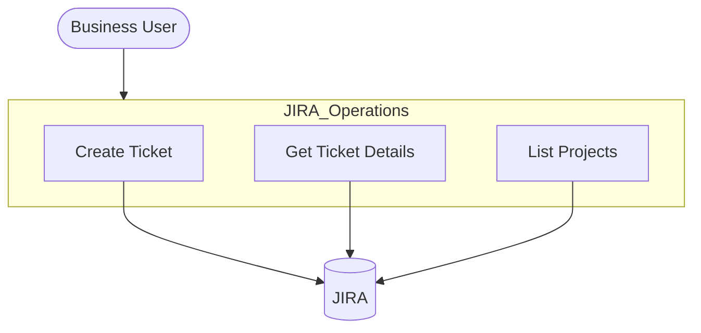

### Creating a Ticket

- Endpoint: `POST /tickets/`
- Payload:
  ```json
  {
    "project_key": "PROJ",
    "summary": "Implement login feature",
    "description": "Create a secure login form with email and password",
    "issue_type": "Story"
  }
  ```

### Getting Ticket Details

- Endpoint: `GET /tickets/{ticket_key}`
- Example: `GET /tickets/PROJ-123`

### Listing Projects

- Endpoint: `GET /projects`

## Advanced Features

### Research Tasks

The system identifies areas where research is needed before implementation can begin.

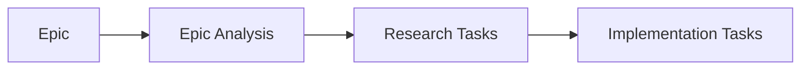

Research tasks typically include:
- Technology evaluation
- Feasibility studies
- API exploration
- Performance benchmarking

### Code Block Generation

The system can generate example code snippets to illustrate implementation approaches.

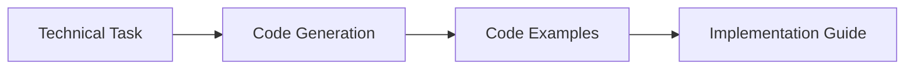

Benefits:
- Provides starter code for developers
- Illustrates architectural patterns
- Demonstrates API usage
- Serves as implementation guidance

### Gherkin Scenario Generation

Convert plain text user stories and acceptance criteria into structured Gherkin scenarios.

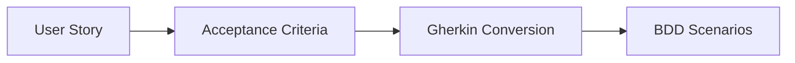

Example transformation:
```
Plain text:
"Users should be able to reset their password using their email address"

Converted to Gherkin:
Feature: Password Reset
  Scenario: User resets password via email
    Given a user has forgotten their password
    When they request a password reset using their email
    Then a reset link should be sent to their email
    And they should be able to set a new password using the link
```

### Test Plans Generation

The system can generate comprehensive test plans for each user story.

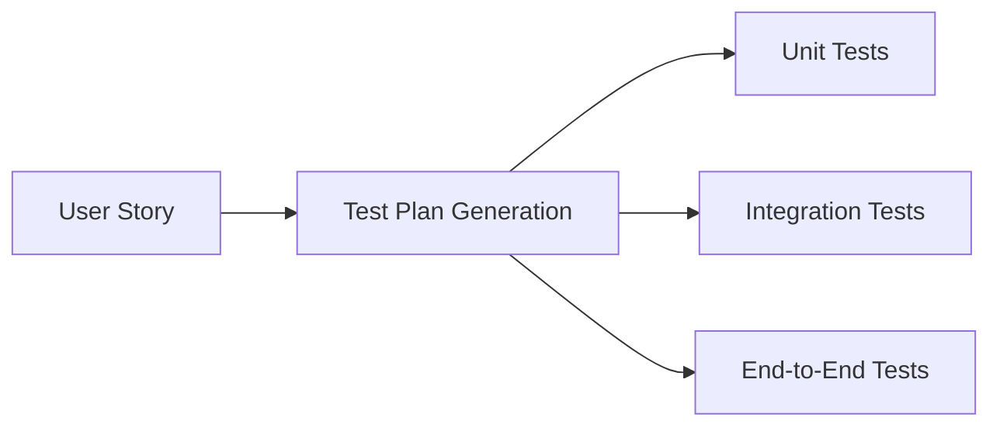

Test plans typically include:
- Test cases for all acceptance criteria
- Edge cases and error scenarios
- Performance testing recommendations
- Security testing considerations

## API Reference

### Epic Breakdown Endpoints

| Endpoint | Method | Description |
|----------|--------|-------------|
| `/break-down-epic/{epic_key}` | POST | Generate breakdown without creating in JIRA |
| `/create-epic-subtasks/{epic_key}` | POST | Break down and optionally create in JIRA |

### LLM Service Endpoints

| Endpoint | Method | Description |
|----------|--------|-------------|
| `/generate-description/` | POST | Generate JIRA ticket description |
| `/analyze-complexity/` | POST | Analyze ticket complexity |
| `/design-architecture/` | POST | Design architecture for an epic |

### Revision Endpoints

| Endpoint | Method | Description |
|----------|--------|-------------|
| `/revise-plan/{execution_id}/ticket/{ticket_id}` | POST | Request plan revision |
| `/confirm-revision-request/{temp_revision_id}` | POST | Confirm revision request |
| `/apply-revision/{temp_revision_id}` | POST | Apply the revision |

### JIRA Endpoints

| Endpoint | Method | Description |
|----------|--------|-------------|
| `/tickets/` | POST | Create a JIRA ticket |
| `/tickets/{ticket_key}` | GET | Get ticket details |
| `/projects` | GET | List JIRA projects |

### Debug Endpoints

| Endpoint | Method | Description |
|----------|--------|-------------|
| `/debug/executions` | GET | List execution plans |
| `/debug/architectures` | GET | List architecture designs | 