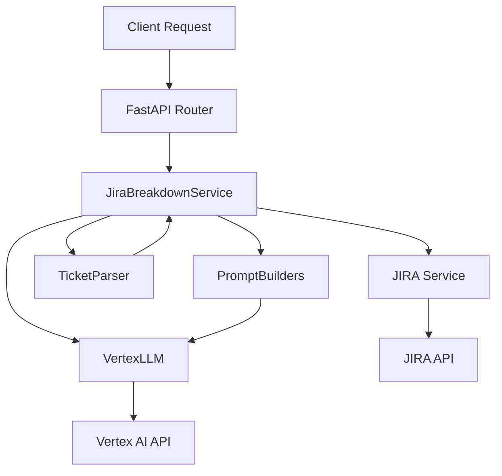
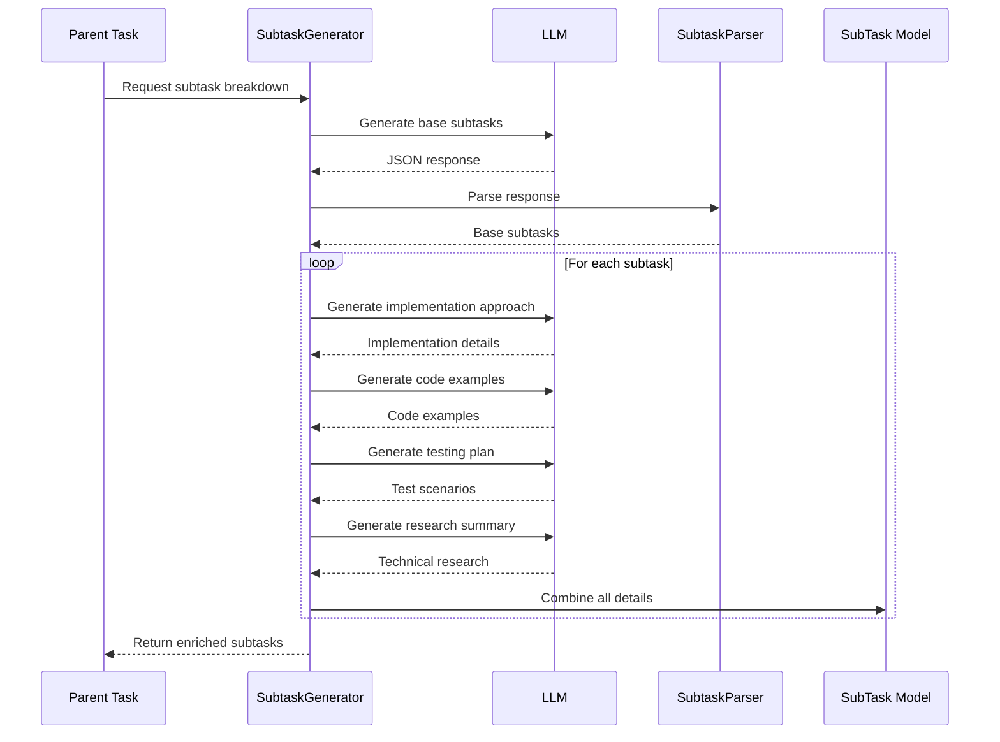
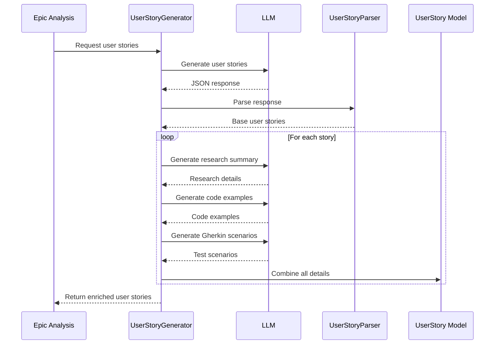
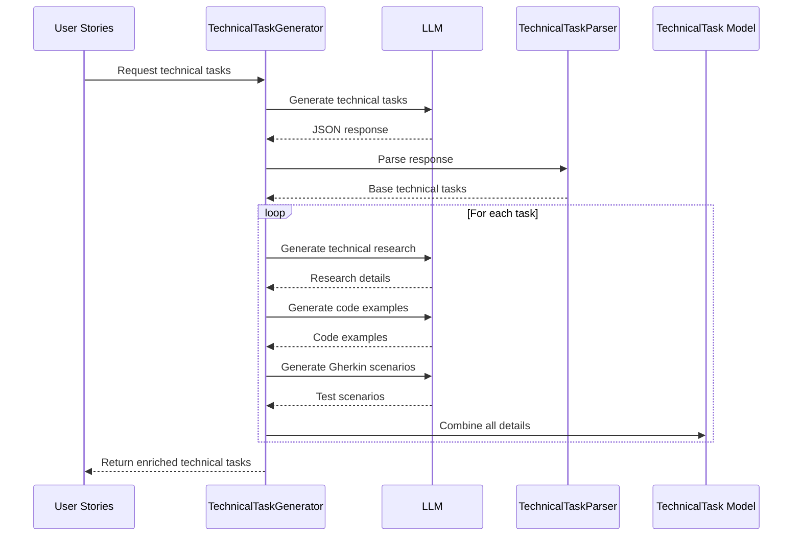
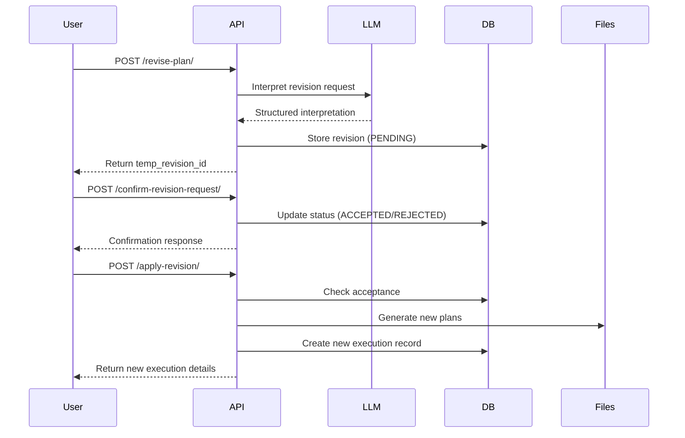

# JIRA Ticket Creator with LLM Support

A FastAPI application that leverages Google's Vertex AI (Gemini) to help create, analyze, and break down JIRA tickets
and epics.

## Architecture

The application follows a modular, service-oriented architecture:

### Core Components

1. **LLM Module** (`llm/`)
    - `vertexllm.py`: Handles communication with Google's Vertex AI service
    - Provides a clean interface for LLM operations

2. **Services** (`services/`)
    - `jira_service.py`: Handles JIRA API interactions
    - `jira_breakdown_service.py`: Orchestrates epic breakdown and ticket creation
    - `ticket_parser_service.py`: Parses LLM responses into structured data

3. **Prompts** (`prompts/`)
    - `base_prompt_builder.py`: Base class for all prompt builders
    - `epic_prompt_builder.py`: Epic analysis and breakdown prompts
    - `user_story_prompt_builder.py`: User story generation prompts
    - `technical_task_prompt_builder.py`: Technical task generation prompts
    - `subtask_prompt_builder.py`: Subtask generation prompts

4. **Routers** (`routers/`)
    - `jira_router.py`: JIRA-related endpoints
    - `llm_router.py`: LLM-related endpoints

5. **Utils** (`utils/`)
    - `logger.py`: Centralized logging configuration

6. **JIRA Integration Module** (`jira_integration/`)
    - `jira_service.py`: High-level JIRA service
    - `operations/`: Core JIRA operations
        - `base_operation.py`: Base class with REST API functionality
        - `epic_operations.py`: Epic-specific operations
        - `ticket_operations.py`: Ticket-specific operations
    - `models/`: Pydantic models for JIRA data
    - `jira_auth_helper.py`: Authentication utilities

### Architecture Flow



### Task Generation Flows

#### Subtask Generation Flow



#### User Story Generation Flow



#### Technical Task Generation Flow



These diagrams illustrate the detailed flow of task generation in the system. Each type of task (subtasks, user stories,
and technical tasks) follows a similar pattern:

1. Initial generation of base tasks
2. Enrichment with additional details through multiple LLM calls
3. Parsing and validation of responses
4. Combination of all details into the final model

The key differences are in:

- The context used for generation (epic analysis, user stories, etc.)
- The specific prompts and enrichment steps
- The final model structure and required fields

## Setup

### Prerequisites

- Python 3.8+
- Google Cloud account with Vertex AI enabled
- JIRA account with API access
- Git

### Environment Setup

1. Clone the repository:

```bash
git clone <repository-url>
cd jira-ticket-creator
```

2. Create and activate a virtual environment:

```bash
python -m venv venv
source venv/bin/activate  # On Windows: venv\Scripts\activate
```

3. Install dependencies:

```bash
pip install -r requirements.txt
```

4. Create a `.env` file:

```env
# JIRA Settings
JIRA_API_TOKEN=your_base64_encoded_token
JIRA_SERVER=https://your-domain.atlassian.net
JIRA_EMAIL=your_email@example.com

# Google Cloud Settings
GOOGLE_CLOUD_PROJECT=your-project-id
GOOGLE_CLOUD_LOCATION=us-central1
GOOGLE_APPLICATION_CREDENTIALS=path/to/your/service-account-key.json
```

### Google Cloud Setup

1. Create a Google Cloud project
2. Enable Vertex AI API
3. Create a service account and download the key file
4. Set the path to your service account key in the `.env` file

### JIRA Setup

1. Generate an API token from your Atlassian account
2. Base64 encode your email:token combination
3. Add the encoded credentials to your `.env` file

## Running the Application

1. Start the application:

```bash
python main.py
```

The API will be available at `http://localhost:8000`

2. Access the API documentation:
    - Swagger UI: `http://localhost:8000/docs`
    - ReDoc: `http://localhost:8000/redoc`

## API Endpoints

### JIRA LLM Operations

- `POST /api/v1/llm/generate-description/`
    - Generate a structured JIRA ticket description
    - Request body: `TicketGenerationRequest`
    - Response: `TicketGenerationResponse`

- `POST /api/v1/llm/analyze-complexity/`
    - Analyze ticket complexity and estimate story points
    - Request body: `ComplexityAnalysisRequest`
    - Response: `ComplexityAnalysisResponse`

- `POST /api/v1/llm/break-down-epic/{epic_key}`
    - Break down a JIRA epic into smaller tasks
    - Path parameter: `epic_key`
    - Response: `EpicBreakdownResponse`

- `POST /api/v1/llm/create-epic-subtasks/{epic_key}`
    - Break down an epic and optionally create subtasks in JIRA
    - Path parameter: `epic_key`
    - Query parameter: `create_in_jira` (boolean)
    - Response: `EpicBreakdownResponse`

## Revision Flow

The application supports a structured workflow for revising execution plans:

### 1. Request Revision

**Endpoint:** `POST /revise-plan/`

- User submits revision request with:
    - `execution_id`: Original execution plan ID
    - `revision_request`: Free-text description of desired changes
- System uses LLM to interpret and structure the request
- Returns a `temp_revision_id` and interpreted changes for confirmation

### 2. Confirm Interpretation

**Endpoint:** `POST /confirm-revision-request/{temp_revision_id}`

- User reviews the LLM's interpretation
- Accepts or rejects the interpretation
- System tracks the decision in SQLite database
- Status updated to ACCEPTED/REJECTED

### 3. Apply Changes

**Endpoint:** `POST /apply-revision/{temp_revision_id}`

- Only proceeds if revision was accepted
- Generates new execution plan with changes
- Creates new files with updated content
- Links new execution to original via parent relationship

### Database Structure

The system uses SQLite to track executions and revisions:

```sql
-- Track execution plans
CREATE TABLE executions
(
    execution_id        TEXT PRIMARY KEY,
    epic_key            TEXT      NOT NULL,
    execution_plan_file TEXT      NOT NULL,
    proposed_plan_file  TEXT      NOT NULL,
    status              TEXT      NOT NULL,
    created_at          TIMESTAMP NOT NULL,
    parent_execution_id TEXT,
    FOREIGN KEY (parent_execution_id) REFERENCES executions (execution_id)
);

-- Track revision requests and their status
CREATE TABLE revisions
(
    revision_id         TEXT PRIMARY KEY,
    execution_id        TEXT      NOT NULL,
    proposed_plan_file  TEXT      NOT NULL,
    execution_plan_file TEXT      NOT NULL,
    status              TEXT      NOT NULL,
    created_at          TIMESTAMP NOT NULL,
    changes_requested   TEXT      NOT NULL,
    changes_interpreted TEXT      NOT NULL,
    accepted            BOOLEAN,
    accepted_at         TIMESTAMP,
    FOREIGN KEY (execution_id) REFERENCES executions (execution_id)
);
```

### File Organization

The system maintains several types of files:

- **Execution Plans**: `execution_plans/EXECUTION_{epic_key}_{timestamp}.md`
    - Contains the detailed execution plan
    - Linked to parent plan for revision tracking

- **Proposed Tickets**: `proposed_tickets/PROPOSED_{epic_key}_{timestamp}.yaml`
    - Contains structured ticket definitions
    - Maintains consistency with execution plan

- **Database**: `data/execution_tracker.db`
    - SQLite database tracking all relationships
    - Stores execution and revision history

### Revision States

A revision can be in one of these states:

- `PENDING`: Initial state when revision is requested
- `ACCEPTED`: User confirmed the interpretation
- `REJECTED`: User rejected the interpretation
- `APPLIED`: Changes have been applied to create new plan

### Example Flow



## Logging

The application uses Loguru for logging:

- Console output: INFO level and above
- File output: DEBUG level and above (in `logs/app.log`)
- Log rotation: 500MB file size
- Log retention: 10 days

## Development

### Project Structure

```
├── llm/
│   ├── __init__.py
│   └── vertexllm.py
├── services/
│   ├── __init__.py
│   ├── jira_service.py
│   ├── jira_breakdown_service.py
│   └── ticket_parser_service.py
├── prompts/
│   ├── __init__.py
│   ├── base_prompt_builder.py
│   ├── epic_prompt_builder.py
│   ├── user_story_prompt_builder.py
│   ├── technical_task_prompt_builder.py
│   └── subtask_prompt_builder.py
├── routers/
│   ├── __init__.py
│   ├── jira_router.py
│   └── llm_router.py
├── utils/
│   ├── __init__.py
│   └── logger.py
├── main.py
├── requirements.txt
└── .env
```

### Adding New Features

1. Add new service classes in the `services/` directory
2. Create new routers in the `routers/` directory
3. Update the OpenAPI documentation in the router decorators
4. Add appropriate logging
5. Update type hints and response models

## Error Handling

The application includes comprehensive error handling:

- HTTP exceptions with detailed error messages
- Logging of all errors with stack traces
- Structured error responses

## Security Considerations

1. In production:
    - Replace `allow_origins=["*"]` with specific origins
    - Secure the API with authentication
    - Use proper HTTPS certificates
    - Restrict JIRA API permissions
    - Implement rate limiting

2. Environment variables:
    - Never commit `.env` file
    - Rotate API keys regularly
    - Use secret management in production

## Contributing

1. Fork the repository
2. Create a feature branch
3. Commit your changes
4. Push to the branch
5. Create a Pull Request

# JIRA Integration

This module provides a refactored JIRA integration that uses direct REST API calls instead of the JIRA Python library.

## Features

- Asynchronous REST API calls to JIRA using aiohttp
- Support for common JIRA operations (issues, epics, transitions, etc.)
- Detailed logging
- Environment-based configuration

## Usage

1. Set up the environment variables:
   ```
   JIRA_SERVER=https://your-domain.atlassian.net
   JIRA_EMAIL=your-email@example.com
   JIRA_API_TOKEN=your-api-token
   ```

2. Import and use the JiraService class:
   ```python
   from jira_integration.jira_service import JiraService
   
   # Create instance
   jira_service = JiraService()
   
   # Get ticket details
   ticket = await jira_service.get_ticket("PROJECT-123")
   
   # Create a new ticket
   new_ticket = await jira_service.create_ticket({
       "project_key": "PROJECT",
       "summary": "Test ticket",
       "description": "This is a test ticket",
       "issue_type": "story",
       "epic_key": "PROJECT-E1"  # Optional
   })
   ```

## Structure

- `jira_service.py` - Main service class that provides the interface to the rest of the application
- `operations/` - Individual operation classes for different JIRA entity types
  - `base_operation.py` - Base class with common REST API functionality
  - `ticket_operations.py` - Operations for stories, tasks, subtasks
  - `epic_operations.py` - Operations for epics

## Dependencies

Required packages:
- aiohttp
- fastapi
- loguru
- python-dotenv
- pydantic

Install with `pip install -r requirements.txt`

## Testing

The project includes comprehensive unit and integration tests for the JIRA integration module.

### Running Tests

To run all tests:

```bash
pytest
```

To run only unit tests:

```bash
pytest -m "not integration"
```

To run only integration tests:

```bash
pytest -m "integration"
```

To generate a coverage report:

```bash
pytest --cov=jira_integration --cov-report=html
```

### Test Structure

Tests are organized to mirror the module structure:

```
tests/
│
├── jira_integration/
│   ├── operations/
│   │   ├── test_base_operation.py
│   │   ├── test_epic_operations.py
│   │   ├── test_ticket_operations.py
│   │
│   ├── test_jira_service.py
│   ├── test_jira_auth_helper.py
│   ├── test_integration.py
│   └── conftest.py
│
└── conftest.py
```

For more details on testing, see [tests/README.md](tests/README.md).

# Viewing Mermaid Diagrams Offline

This repository contains tools to help you view and convert Mermaid diagrams when your VS Code plugin isn't working.

## Option 1: HTML Viewer (No Installation Required)

The `mermaid_viewer.html` file is a standalone HTML page that allows you to:
- Load markdown files containing Mermaid diagrams
- Paste Mermaid code directly
- Render the diagrams in your browser
- Save diagrams as SVG or PNG files
- **NEW!** Support for AWS and GCP architecture icons

**How to use:**
1. Open `mermaid_viewer.html` in any modern web browser
2. Load your markdown file or paste your Mermaid code
3. Click "Render Diagram" to view
4. Use the "Save as SVG" or "Save as PNG" buttons to export

### Cloud Architecture Icons

The viewer now supports AWS and GCP architecture icons through the Iconify icon pack. Use them in your diagrams with:

```
service myService(logos:aws-lambda)[AWS Lambda Function]
```

Common cloud icons:
- `logos:aws-lambda` - AWS Lambda
- `logos:aws-s3` - AWS S3
- `logos:aws-ec2` - AWS EC2
- `logos:aws-dynamodb` - AWS DynamoDB
- `logos:google-cloud` - Google Cloud
- `logos:kubernetes` - Kubernetes

For more icons, visit the [Iconify Logos Collection](https://icon-sets.iconify.design/logos/).

### Accessing via FastAPI

The viewer is also integrated with the FastAPI application for convenient access:

1. Start the application:
   ```bash
   python main.py
   ```

2. Access the viewer through these URLs:
   - `/mermaid-viewer` - Direct access via dedicated endpoint
   - `/static/mermaid_viewer.html` - Access via static file server

This allows you to view Mermaid diagrams while using the rest of the application's features!

## Option 2: Python Converter Script

The `mermaid_converter.py` script extracts Mermaid diagrams from markdown files and converts them to PNG or SVG images.

**Requirements:**
- Python 3
- Node.js
- mermaid-cli package

**Installation:**
```bash
# Install Node.js dependencies
npm install -g @mermaid-js/mermaid-cli
```

**Usage:**
```bash
# Convert diagrams in a markdown file to PNG
python mermaid_converter.py path/to/architecture_file.md

# Convert to SVG with custom output directory
python mermaid_converter.py path/to/architecture_file.md --format svg --output-dir ./my_diagrams
```

## Option 3: Online Mermaid Editor

If you have internet access, you can use the Mermaid Live Editor:
- Go to https://mermaid.live/
- Paste your Mermaid code
- Download as PNG, SVG or other formats

## Option 4: Browser Extensions

Several browser extensions can render Mermaid diagrams in GitHub or other markdown contexts:
- Markdown Diagrams (Chrome)
- Mermaid Diagrams (Firefox)

## Additional Resources

- [Mermaid Documentation](https://mermaid-js.github.io/mermaid/#/)
- [Mermaid CLI GitHub](https://github.com/mermaid-js/mermaid-cli)

