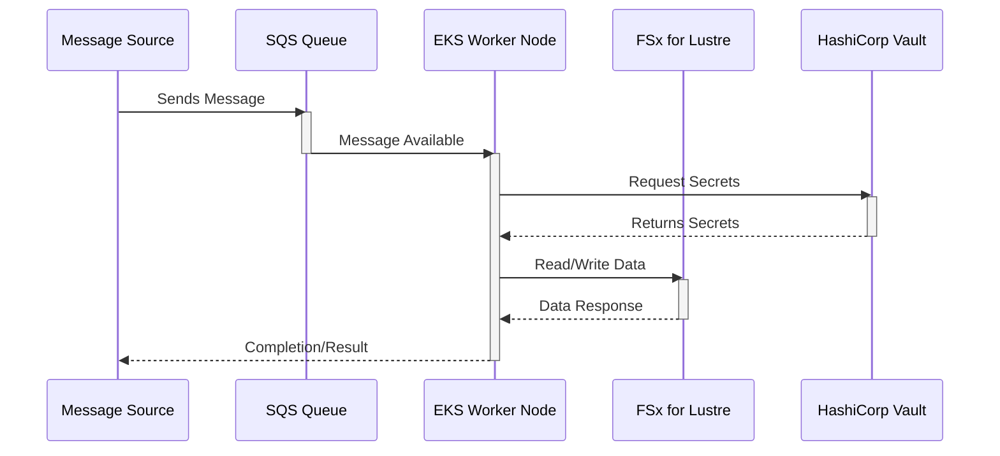

# Architecture Design for DP-211

* **Cloud Provider:** AWS
* **Execution ID:** 5aa84d30-3fd5-4eb2-a427-91cd8097abd3
* **Date:** 2025-02-26 23:06:32

## Architecture Overview

Okay, here's a comprehensive architecture design for the GRID Compute system on AWS, addressing the requirements for scalability, burstability, high-speed storage, container orchestration, Vault integration, and message queuing.

**1. Architecture Overview**

The architecture is designed around a containerized application deployed on Amazon EKS (Elastic Kubernetes Service) for maximum flexibility and control over the container orchestration.  EKS allows us to easily scale the master and worker pools based on demand.  A high-speed, low-latency file system, Amazon FSx for Lustre, is used to provide the necessary storage performance for the GRID compute application.  HashiCorp Vault is integrated for secure secret management.  Amazon SQS (Simple Queue Service) is used as the message queue to decouple the message source from the GRID compute application.

**Key Design Decisions:**

*   **Container Orchestration:** EKS was chosen for its flexibility and control over the container environment. This allows for easy scaling, rolling updates, and the ability to change underlying node types as needed.
*   **High-Speed Storage:** Amazon FSx for Lustre is selected for its high performance and low latency, crucial for the GRID compute application.
*   **Secret Management:** HashiCorp Vault is integrated for secure storage and management of sensitive data, such as API keys and database credentials.
*   **Message Queue:** SQS is used to decouple the message source from the GRID compute application, enabling asynchronous processing and improved scalability.
*   **High Availability:** The architecture is designed for high availability by deploying resources across multiple Availability Zones (AZs) and using load balancers.
*   **Security:** Security is a top priority, with IAM roles and policies used to control access to resources, and encryption used for data at rest and in transit.

**2. Diagrams**

**a. System Architecture Diagram**

## AWS Diagram 1

```mermaid
graph LR
    subgraph AWS Cloud
        subgraph VPC
            subgraph EKS Cluster
                subgraph Master Nodes
                    EKS_Master1((fa:fa-server EKS Master Node 1))
                    EKS_Master2((fa:fa-server EKS Master Node 2))
                    EKS_Master3((fa:fa-server EKS Master Node 3))
                end
                subgraph Worker Nodes
                    Worker_Node_Group1[Worker Node Group 1]
                    Worker_Node_Group2[Worker Node Group 2]
                    Worker_Node_Group1 --- FSx
                    Worker_Node_Group2 --- FSx
                end
                EKS_LB((fa:fa-server EKS Load Balancer))
            end
            subgraph FSx for Lustre
                FSx((fa:fa-database FSx for Lustre))
            end
            subgraph SQS
                SQS((fa:fa-envelope SQS Queue))
            end
            subgraph Vault
                Vault_Cluster((fa:fa-lock Vault Cluster))
            end
            subgraph ALB
                ALB((fa:fa-server Application Load Balancer))
            end
            Internet((fa:fa-globe Internet))
            Route53((fa:fa-cloud Route 53))
        end
    end

    Internet --> Route53
    Route53 --> ALB
    ALB --> EKS_LB
    EKS_LB --> EKS_Master1
    EKS_LB --> EKS_Master2
    EKS_LB --> EKS_Master3
    SQS --> Worker_Node_Group1
    SQS --> Worker_Node_Group2
    Worker_Node_Group1 --> Vault_Cluster
    Worker_Node_Group2 --> Vault_Cluster
    style ALB fill:#f9f,stroke:#333,stroke-width:2px
    style FSx fill:#f9f,stroke:#333,stroke-width:2px
    style SQS fill:#f9f,stroke:#333,stroke-width:2px
    style Vault_Cluster fill:#f9f,stroke:#333,stroke-width:2px
    style EKS_LB fill:#f9f,stroke:#333,stroke-width:2px
```

**Description:**

This diagram shows the high-level system architecture.  External requests come in through the Internet, are resolved by Route 53, and then routed to an Application Load Balancer (ALB). The ALB forwards requests to the EKS Load Balancer, which distributes traffic across the EKS master nodes.  Worker nodes consume messages from the SQS queue and access secrets from the Vault cluster.  The worker nodes also interact with the FSx for Lustre file system for high-speed data access.

**b. Sequence Diagram: Message Processing Workflow**

## AWS Diagram 2



**Description:**

This sequence diagram illustrates the message processing workflow.  A message source sends a message to the SQS queue.  An EKS worker node retrieves the message from the queue.  The worker node then requests secrets from HashiCorp Vault.  After receiving the secrets, the worker node reads/writes data to the FSx for Lustre file system.  Finally, the worker node sends a completion or result message back to the message source.

**c. Deployment Diagram**

## AWS Diagram 3

```mermaid
deploymentDiagram
    node("AWS Region") {
        node("Availability Zone A") {
            node("Public Subnet") {
                ALB[Application Load Balancer]
            }
            node("Private Subnet") {
                EKS_Master1[EKS Master Node 1]
                EKS_Worker1[EKS Worker Node 1]
                FSx1[FSx for Lustre Endpoint]
            }
        }
        node("Availability Zone B") {
            node("Private Subnet") {
                EKS_Master2[EKS Master Node 2]
                EKS_Worker2[EKS Worker Node 2]
                FSx2[FSx for Lustre Endpoint]
            }
        }
        node("Availability Zone C") {
            node("Private Subnet") {
                EKS_Master3[EKS Master Node 3]
                EKS_Worker3[EKS Worker Node 3]
                FSx3[FSx for Lustre Endpoint]
            }
        }
        node("Shared Services") {
            SQS[SQS Queue]
            Vault[HashiCorp Vault Cluster]
        }
    }
    ALB -- EKS_Master1
    ALB -- EKS_Master2
    ALB -- EKS_Master3
    EKS_Worker1 -- FSx1
    EKS_Worker2 -- FSx2
    EKS_Worker3 -- FSx3
    EKS_Worker1 -- SQS
    EKS_Worker2 -- SQS
    EKS_Worker3 -- SQS
    EKS_Worker1 -- Vault
    EKS_Worker2 -- Vault
    EKS_Worker3 -- Vault
```

**Description:**

This deployment diagram shows how the components are deployed across multiple Availability Zones (AZs) for high availability.  The Application Load Balancer (ALB) is deployed in a public subnet, while the EKS master nodes, worker nodes, and FSx for Lustre endpoints are deployed in private subnets.  The SQS queue and HashiCorp Vault cluster are deployed in a shared services environment.  This ensures that the system can continue to operate even if one AZ fails.

**3. Component Details and Configuration**

*   **EKS Cluster:**
    *   Managed Kubernetes service.
    *   Configured with multiple worker node groups to allow for different instance types and scaling policies.
    *   Uses IAM roles for service accounts to grant permissions to pods.
    *   Uses Kubernetes Horizontal Pod Autoscaler (HPA) to automatically scale the number of pods based on CPU utilization or other metrics.
*   **FSx for Lustre:**
    *   High-performance file system optimized for compute-intensive workloads.
    *   Configured with the appropriate storage capacity and throughput based on the application's requirements.
    *   Mounted on the worker nodes using the FSx client.
*   **HashiCorp Vault:**
    *   Used for secure storage and management of secrets.
    *   Deployed as a highly available cluster.
    *   Accessed by the worker nodes using the Vault Kubernetes authentication method.
*   **SQS Queue:**
    *   Used as a message queue to decouple the message source from the GRID compute application.
    *   Configured with the appropriate message retention period and visibility timeout.
    *   Accessed by the worker nodes using the AWS SDK.
*   **Application Load Balancer (ALB):**
    *   Distributes traffic across the EKS master nodes.
    *   Configured with health checks to ensure that only healthy nodes receive traffic.
    *   Uses HTTPS listener with a valid SSL certificate.
*   **IAM Roles and Policies:**
    *   Used to control access to AWS resources.
    *   Each component is assigned an IAM role with the minimum necessary permissions.
    *   IAM policies are used to define the permissions granted to each role.

**4. Security Considerations**

*   **Network Security:**
    *   The VPC is configured with private subnets for the EKS master nodes, worker nodes, and FSx for Lustre endpoints.
    *   Network ACLs and security groups are used to control traffic in and out of the VPC.
    *   A NAT gateway is used to allow the worker nodes to access the internet for updates and package installations.
*   **Data Encryption:**
    *   Data at rest is encrypted using KMS.
    *   Data in transit is encrypted using TLS.
*   **Identity and Access Management:**
    *   IAM roles and policies are used to control access to AWS resources.
    *   Multi-factor authentication (MFA) is enabled for all IAM users.
*   **Vulnerability Management:**
    *   Regularly scan the EKS cluster and worker nodes for vulnerabilities.
    *   Apply security patches and updates promptly.
*   **Logging and Monitoring:**
    *   Enable CloudTrail to log all API calls made to AWS resources.
    *   Use CloudWatch to monitor the performance and health of the system.
    *   Set up alerts to notify administrators of any issues.

**5. Scalability and Performance**

*   **EKS Cluster:** The EKS cluster can be scaled horizontally by adding more worker nodes.
*   **FSx for Lustre:** The FSx for Lustre file system can be scaled by increasing the storage capacity and throughput.
*   **SQS Queue:** The SQS queue can handle a large volume of messages.
*   **Auto Scaling:**  Horizontal Pod Autoscaler (HPA) will automatically scale the number of pods based on CPU utilization or other metrics.  Cluster Autoscaler can be used to scale the underlying EC2 instances in the worker node groups.

**6. Cost Optimization**

*   **Right-Sizing:** Choose the appropriate instance types for the worker nodes based on the application's requirements.
*   **Reserved Instances:** Use reserved instances for the worker nodes to reduce costs.
*   **Spot Instances:** Consider using spot instances for the worker nodes to further reduce costs.  However, be aware that spot instances can be terminated at any time.
*   **Storage Optimization:** Use the appropriate storage tier for the FSx for Lustre file system based on the data access patterns.
*   **Data Lifecycle Management:** Implement a data lifecycle management policy to automatically move data to lower-cost storage tiers as it ages.

This architecture provides a robust, scalable, and secure platform for the GRID Compute application on AWS. It leverages the strengths of EKS, FSx for Lustre, and HashiCorp Vault to meet the application's requirements for flexibility, performance, and security.

