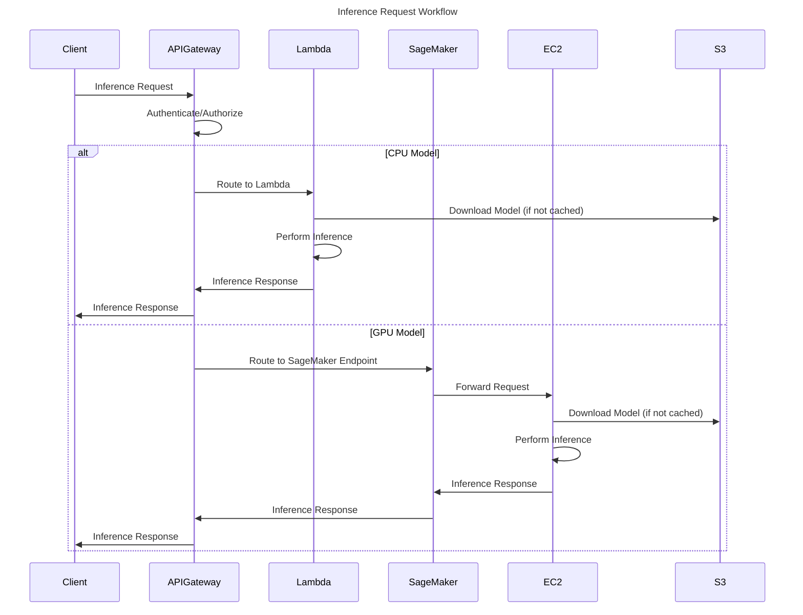

# Architecture Design for TEST-123

* **Cloud Provider:** AWS
* **Execution ID:** 50434c1f-62e8-4a62-82b5-262b7f142016
* **Date:** 2025-02-26 23:37:01

## Architecture Overview

Okay, here's a comprehensive architecture design for a cloud-based AI Inference Platform on AWS, addressing the requirements for high-throughput, auto-scaling, security, and cost optimization.

**1. Architecture Overview**

The architecture is designed to provide a scalable and cost-effective platform for serving AI models. It leverages a combination of serverless and containerized services to handle varying workloads efficiently.

*   **API Gateway:**  Acts as the entry point for all client requests, providing authentication, authorization, rate limiting, and request routing.
*   **Inference Service:** This is the core component responsible for running the AI models.  We'll use a combination of AWS Lambda for CPU-based models and Amazon SageMaker endpoints backed by GPU-enabled EC2 instances for accelerated inference.  The choice between Lambda and SageMaker depends on the model size, latency requirements, and GPU needs.
*   **Auto-Scaling:**  AWS Auto Scaling Groups will manage the number of EC2 instances behind the SageMaker endpoints, scaling up or down based on the incoming request rate.  Lambda functions will scale automatically.
*   **Data Storage:**  Amazon S3 will store the AI models and any input/output data.
*   **Monitoring and Logging:**  Amazon CloudWatch will collect metrics and logs from all components, providing visibility into the platform's performance and health.  AWS CloudTrail will track API calls for auditing purposes.
*   **Security:**  IAM roles and policies will control access to all AWS resources.  API Gateway will handle authentication and authorization.  VPC will provide network isolation.
*   **MLOps Integration:**  The platform is designed to integrate with existing MLOps pipelines.  Models can be deployed to S3 via CI/CD pipelines, triggering updates to the SageMaker endpoints.

**2. Diagrams**

**a. System Architecture Diagram**

## AWS Diagram 1

*Description:* This diagram illustrates the high-level architecture of the AI Inference Platform. It shows how client applications interact with the API Gateway, which then routes requests to either Lambda functions (for CPU-based inference) or SageMaker endpoints (for GPU-accelerated inference).  S3 stores the AI models and input/output data. CloudWatch and CloudTrail provide monitoring and logging capabilities. IAM and Cognito handle security aspects.

**b. Sequence Diagram**

## AWS Diagram 2

*Description:* This sequence diagram shows the workflow for an inference request. The client sends a request to the API Gateway, which authenticates and authorizes the request. Based on the model type (CPU or GPU), the request is routed to either a Lambda function or a SageMaker endpoint. The inference is performed, and the response is returned to the client.

**c. Deployment Diagram**

## AWS Diagram 3

*Description:* This deployment diagram shows how the components are deployed within the AWS cloud. The API Gateway is deployed in a public subnet to allow external access. The Lambda functions, SageMaker endpoint, EC2 instances, and S3 bucket are deployed in private subnets for enhanced security.  CloudWatch monitors all components.

**3. Additional Considerations**

*   **Cost Optimization:**
    *   Use AWS Lambda for models that don't require GPU acceleration and have low latency requirements. Lambda is cost-effective for infrequent or bursty workloads.
    *   Utilize SageMaker's managed endpoints with auto-scaling for GPU-based models.  Configure scaling policies to minimize the number of active instances during idle periods.  Consider using SageMaker Inference Pipelines to optimize inference costs.
    *   Use S3 lifecycle policies to move infrequently accessed data to lower-cost storage tiers (e.g., S3 Glacier).
*   **Security:**
    *   Implement robust authentication and authorization using AWS Cognito and IAM.
    *   Use VPC endpoints for S3 to ensure that traffic between the compute resources and S3 remains within the AWS network.
    *   Enable encryption at rest and in transit for all data.
    *   Regularly audit security configurations using AWS Inspector and Trusted Advisor.
*   **Monitoring and Logging:**
    *   Set up comprehensive monitoring using CloudWatch metrics, alarms, and dashboards.
    *   Enable CloudTrail to track API calls for auditing and security analysis.
    *   Use CloudWatch Logs Insights to analyze log data.
*   **MLOps Integration:**
    *   Automate model deployment using CI/CD pipelines.
    *   Use SageMaker Model Registry to manage model versions.
    *   Implement model monitoring to detect and address model drift.
*   **High Availability:**
    *   Deploy the API Gateway and SageMaker endpoints across multiple Availability Zones.
    *   Use Auto Scaling Groups to ensure that the EC2 instances are highly available.
    *   Use S3's built-in redundancy to protect data.

This architecture provides a solid foundation for building a scalable, secure, and cost-effective AI Inference Platform on AWS. Remember to tailor the specific service configurations and scaling policies to your specific model characteristics and workload patterns.

