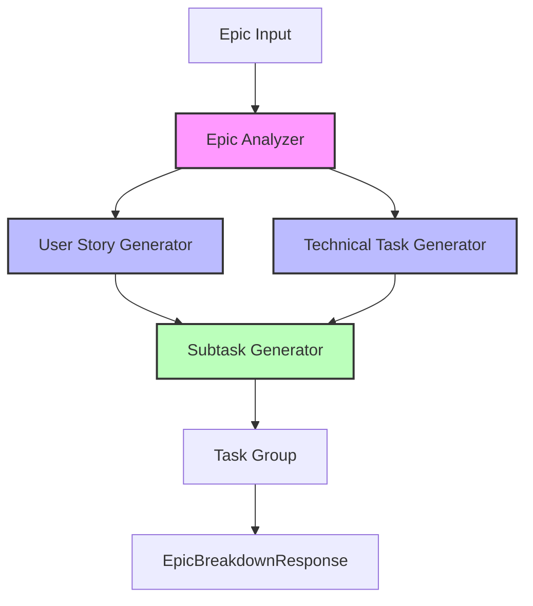

# Epic Breakdown Module

This module is responsible for breaking down epics into smaller, manageable tasks using LLM-powered analysis and generation. It follows a structured approach to create a complete hierarchy of tasks from epics.

## Architecture Overview

The module follows a layered architecture with clear separation of concerns:



### Core Components

1. **Epic Analyzer** (`epic_analyzer.py`)
   - Analyzes epic scope and requirements
   - Determines technical domains and core requirements
   - Provides structured analysis for task generation
   - Uses Vertex AI for semantic analysis

2. **User Story Generator** (`user_story_generator.py`)
   - Generates user stories from epic analysis
   - Creates complete user story models with:
     - Research summaries
     - Code examples
     - Gherkin scenarios
   - Integrates with task tracking and ticket management

3. **Technical Task Generator** (`technical_task_generator.py`)
   - Creates technical tasks based on user stories
   - Generates implementation approaches
   - Includes code examples and testing requirements
   - Handles technical dependencies

4. **Rerun Helper** (`rerun_helper.py`)
   - Supports rerunning parts of the breakdown process
   - Maintains state consistency
   - Handles task regeneration
   - Manages execution context

## Business Logic

### Epic Breakdown Flow

1. **Analysis Phase**
   ```mermaid
   sequenceDiagram
       participant Epic
       participant Analyzer
       participant LLM
       participant Analysis

       Epic->>Analyzer: Submit epic
       Analyzer->>LLM: Generate analysis prompt
       LLM-->>Analyzer: Raw analysis
       Analyzer->>Analysis: Parse and structure
       Analysis-->>Epic: Return AnalysisInfo
   ```

2. **Task Generation Phase**
   ```mermaid
   sequenceDiagram
       participant Analysis
       participant Generator
       participant LLM
       participant Tasks

       Analysis->>Generator: Submit analysis
       Generator->>LLM: Generate tasks prompt
       LLM-->>Generator: Raw tasks
       Generator->>Tasks: Parse and enrich
       Generator->>LLM: Generate additional details
       LLM-->>Generator: Enrichment data
       Generator->>Tasks: Create final models
   ```

### Key Features

1. **Intelligent Task Breakdown**
   - Uses LLM to understand epic context
   - Generates appropriate mix of user stories and technical tasks
   - Ensures complete coverage of requirements

2. **Rich Task Context**
   - Research summaries for implementation guidance
   - Code examples for technical reference
   - Gherkin scenarios for acceptance testing
   - Technical considerations and dependencies

3. **Flexible Execution**
   - Support for partial regeneration
   - State persistence and recovery
   - Execution tracking and logging

## Data Models

### Core Models

1. **AnalysisInfo**
   - Main objective
   - Technical domains
   - Core requirements
   - Stakeholders

2. **TaskGroup**
   - High-level task (User Story or Technical Task)
   - Associated subtasks
   - Dependencies and relationships

3. **EpicBreakdownResponse**
   - Execution metadata
   - Analysis results
   - Generated tasks
   - Metrics and statistics

## Configuration

The module's behavior can be customized through settings:

```python
ENABLE_RESEARCH_TASKS=True
ENABLE_CODE_BLOCK_GENERATION=True
ENABLE_GHERKIN_SCENARIOS=True
```

## Usage Example

```python
from breakdown.epic_analyzer import EpicAnalyzer
from breakdown.execution_manager import ExecutionManager

# Initialize components
execution_manager = ExecutionManager(epic_key)
epic_analyzer = EpicAnalyzer(execution_manager.execution_log)

# Analyze epic
analysis = await epic_analyzer.analyze_epic(epic_summary, epic_description)

# Generate tasks
user_stories = await user_story_generator.generate_user_stories(
    analysis,
    task_tracker,
    proposed_tickets
)

technical_tasks = await technical_task_generator.generate_technical_tasks(
    user_stories,
    analysis,
    task_tracker,
    proposed_tickets
)
```

## Error Handling

The module implements comprehensive error handling:

1. **Task Generation Errors**
   - Graceful degradation of features
   - Detailed error logging
   - State recovery options

2. **LLM Integration Errors**
   - Retry mechanisms
   - Format fixing for malformed responses
   - Fallback strategies

## Integration Points

1. **LLM Service**
   - Vertex AI integration
   - Prompt management
   - Response parsing

2. **Task Tracking**
   - MongoDB persistence
   - State management
   - Execution logging

3. **Ticket Management**
   - YAML file generation
   - JIRA integration support
   - Revision tracking

## Best Practices

1. **Code Organization**
   - Clear separation of concerns
   - Modular component design
   - Comprehensive logging
   - Type safety

2. **Error Handling**
   - Graceful degradation
   - Detailed error messages
   - Recovery mechanisms
   - State consistency

3. **Performance**
   - Asynchronous operations
   - Efficient state management
   - Optimized LLM calls
   - Caching where appropriate

## Contributing

When contributing to this module:

1. Follow the existing architecture patterns
2. Maintain comprehensive logging
3. Add appropriate error handling
4. Update tests for new functionality
5. Document changes in this README 