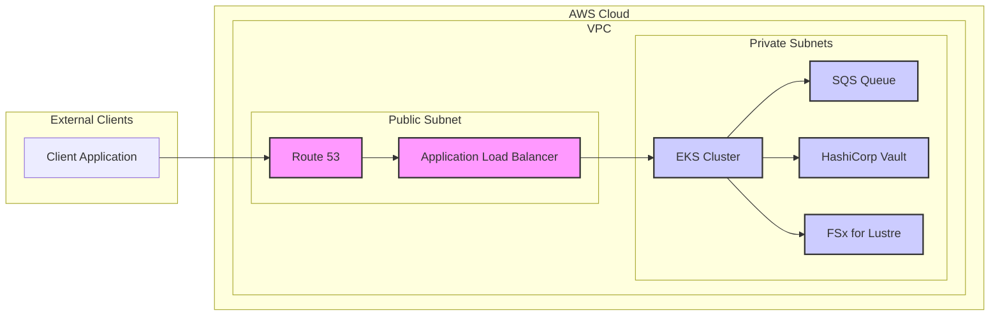
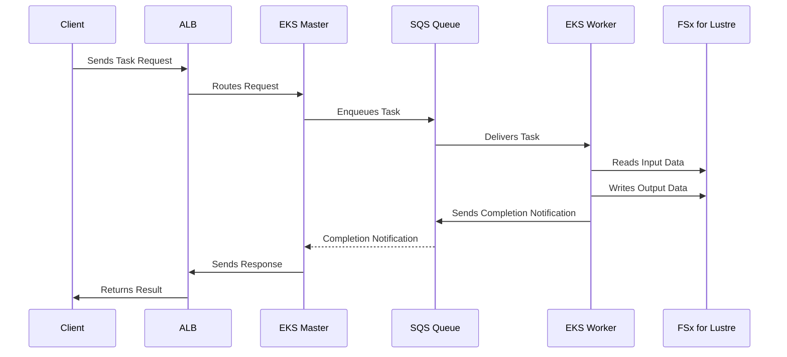
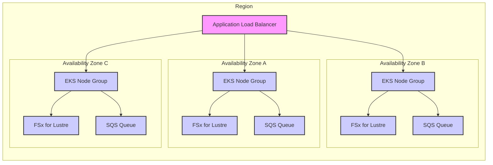

# EXECUTION_PLAN_ID: 067bf9dd-562b-715f-8000-22af47a40a68

## Epic: DP-211
## Started: 2025-02-26T23:03:50.135009+00:00


## Execution Record

```json
{
  "execution_id": "8b87d076-913a-4ef7-8c7d-76579f756008",
  "epic_key": "DP-211",
  "execution_plan_file": "execution_plans/EXECUTION_DP-211_20250226_230349.md",
  "proposed_plan_file": "",
  "status": "IN_PROGRESS",
  "created_at": "2025-02-26 23:03:50.933327+00:00",
  "_id": "67bf9dd6c40b42be94b7408a"
}
```

## Architecture Design Request

```
Generating architecture design for DP-211 using AWS

Epic Summary: GRID Compute

Additional Context: High Availability is essential
```

## Architecture Design Generation

### Prompt
```

        You are a senior solutions architect with expertise in cloud architecture design. 
        You need to create a comprehensive architecture design for the following system requirements:
        
        Epic Title: GRID Compute
        
        Epic Description:
        We would like to host a highly scalable, and burst-able grid compute application, which is currently containerised. We would like it to connect and use a Hashicorp Vault, and for it to be hosted on AWS. 

It would require a high-speed file-system, with super low latency that can work. We would like flexibility over our container hosting solution, and the ability to change the underlying node types and so we are thinking EKS on AWS as a possibility. 

Finally we would need some sort of ingress and queue mechanism to source messages for the GRID. 

The GRID has a master pool, and a worker pool, the masters break complex tasks into smaller units that the worker pools consume from. 
        
        Additional Context (if provided):
        High Availability is essential
        
        Target Cloud Provider: AWS
        
        Approved Services: EC2, Lambda, ECS, EKS, Fargate, Batch, Lightsail, S3, EBS, EFS, FSx, Storage Gateway, RDS, DynamoDB, ElastiCache, Neptune, Redshift, DocumentDB, QLDB, Keyspaces, Timestream, VPC, CloudFront, Route 53, API Gateway, Direct Connect, Transit Gateway, App Mesh, Global Accelerator, IAM, Cognito, Secrets Manager, GuardDuty, Inspector, CloudTrail, Shield, WAF, KMS, Certificate Manager, Athena, EMR, CloudSearch, Elasticsearch Service, Kinesis, QuickSight, Data Pipeline, Glue, Lake Formation, SQS, SNS, EventBridge, MQ, SES, Step Functions, CloudWatch, CloudFormation, Systems Manager, Control Tower, Config, OpsWorks, Service Catalog, Trusted Advisor, ECR, ECS, EKS, App Runner, CodeCommit, CodeBuild, CodeDeploy, CodePipeline, CodeStar, Cloud9, X-Ray, SageMaker, Comprehend, Translate, Rekognition, Polly, Lex, Personalize
        
        Please design a complete architecture that meets these requirements. Your response should include:
        
        1. An architecture overview that explains the high-level design decisions and approach
        2. The following diagrams in mermaid format:
           a. A system architecture diagram showing all components and their relationships
           b. At least one sequence diagram showing key workflows
           c. A deployment diagram showing how components are deployed in the cloud
        
        For each diagram:
        - Use proper mermaid syntax for AWS architecture diagrams
        - Focus on clarity and readability
        - Provide a brief description explaining what the diagram shows
        
        Ensure that your architecture follows best practices for AWS and only uses services from the approved list.
        
```

### Raw Response
```
Okay, here's a comprehensive architecture design for the GRID Compute system on AWS, addressing the requirements for scalability, burstability, high-speed file system, container orchestration flexibility, HashiCorp Vault integration, and message queuing.

**1. Architecture Overview**

The architecture leverages EKS for container orchestration, providing the flexibility to manage container deployments and scale the GRID compute application.  FSx for Lustre is used for the high-performance file system, catering to the low-latency requirements. SQS is used for message queuing, enabling asynchronous communication between the master and worker pools. HashiCorp Vault is integrated for secure secret management.  The architecture is designed for high availability across multiple Availability Zones (AZs).

*   **Container Orchestration:** EKS is chosen for its flexibility and control over the container environment. This allows for easy scaling, rolling updates, and the ability to change underlying node types as needed.
*   **High-Speed File System:** FSx for Lustre is selected for its low latency and high throughput, essential for the GRID compute application's performance.
*   **Message Queuing:** SQS is used to decouple the master and worker pools, enabling asynchronous processing and improved scalability.
*   **Secret Management:** HashiCorp Vault is integrated to securely store and manage sensitive information, such as database credentials and API keys.
*   **High Availability:** The architecture is designed to be highly available by deploying resources across multiple Availability Zones (AZs).  EKS clusters are configured to span multiple AZs, and FSx for Lustre file systems can be configured for replication.
*   **Security:** Security is a primary consideration, with IAM roles and policies used to control access to resources.  Network security groups are used to restrict traffic to specific ports and protocols.  Encryption is used for data at rest and in transit.
*   **Monitoring and Logging:** CloudWatch is used for monitoring the health and performance of the system.  CloudTrail is used for auditing API calls.

**2. Diagrams**

**a. System Architecture Diagram**



*Description:* This diagram shows the high-level system architecture. Clients access the application through Route 53, which routes traffic to the Application Load Balancer (ALB). The ALB distributes traffic to the EKS cluster. The EKS cluster interacts with SQS for message queuing, HashiCorp Vault for secret management, and FSx for Lustre for the high-performance file system.

**b. Sequence Diagram: Task Processing**



*Description:* This sequence diagram illustrates the workflow for processing a task. The client sends a request, which is routed to the EKS master. The master enqueues the task in SQS. An EKS worker consumes the task, reads input data from FSx for Lustre, writes output data to FSx for Lustre, and sends a completion notification to SQS. The master receives the notification and sends a response back to the client.

**c. Deployment Diagram**



*Description:* This deployment diagram shows how the components are deployed across multiple Availability Zones (AZs) for high availability. The EKS node groups, FSx for Lustre file systems, and SQS queues are deployed in each AZ. The Application Load Balancer (ALB) distributes traffic across the EKS node groups in different AZs.  FSx can be configured to replicate data between AZs.  SQS is a regional service and is inherently highly available.

**3. Detailed Component Descriptions and Configuration**

*   **EKS Cluster:**
    *   Managed Kubernetes service.
    *   Configured with multiple node groups for the master and worker pools.
    *   Node groups can be scaled up or down based on demand.
    *   IAM roles are used to grant the EKS cluster access to other AWS resources.
    *   Kubernetes autoscaling is configured to automatically scale the number of pods based on CPU and memory utilization.
*   **FSx for Lustre:**
    *   High-performance file system optimized for compute-intensive workloads.
    *   Provides low latency and high throughput.
    *   Can be configured with different storage tiers based on performance requirements.
    *   Integrated with EKS for seamless access to the file system from the containers.
*   **SQS Queue:**
    *   Fully managed message queuing service.
    *   Used to decouple the master and worker pools.
    *   Provides reliable message delivery.
    *   Can be scaled up or down based on demand.
*   **HashiCorp Vault:**
    *   Used for secure secret management.
    *   Secrets are stored encrypted and accessed through API calls.
    *   Integrated with EKS for seamless access to secrets from the containers.
*   **Application Load Balancer (ALB):**
    *   Distributes traffic to the EKS cluster.
    *   Provides high availability and scalability.
    *   Can be configured with different routing rules based on the request.
*   **IAM Roles and Policies:**
    *   Used to control access to AWS resources.
    *   Each component is assigned an IAM role with the minimum necessary permissions.
    *   IAM policies are used to define the permissions for each role.
*   **CloudWatch:**
    *   Used for monitoring the health and performance of the system.
    *   Metrics are collected for CPU utilization, memory utilization, network traffic, and other key performance indicators.
    *   Alarms are configured to notify administrators of potential issues.
*   **CloudTrail:**
    *   Used for auditing API calls.
    *   Logs are stored in S3 for long-term retention.
    *   Can be used to track changes to the system and identify security threats.

**4. Scalability and Burstability**

*   **EKS:** The EKS cluster can be scaled up or down by adding or removing nodes. Kubernetes autoscaling can be used to automatically scale the number of pods based on demand.
*   **FSx for Lustre:** The storage capacity and throughput of the FSx for Lustre file system can be scaled up or down as needed.
*   **SQS:** SQS is a fully managed service and can be scaled up or down automatically based on demand.
*   **ALB:** The ALB can handle a large number of requests and can be scaled up or down automatically based on demand.

**5. Security Considerations**

*   **IAM Roles and Policies:** Use IAM roles and policies to control access to AWS resources.
*   **Network Security Groups:** Use network security groups to restrict traffic to specific ports and protocols.
*   **Encryption:** Use encryption for data at rest and in transit.
*   **Vulnerability Scanning:** Regularly scan the system for vulnerabilities.
*   **Security Audits:** Conduct regular security audits.
*   **Hashicorp Vault:** Securely store and manage secrets using Hashicorp Vault.

**6. Cost Optimization**

*   **Right-Sizing:** Right-size the EC2 instances used for the EKS nodes.
*   **Reserved Instances:** Use reserved instances for the EC2 instances to save money.
*   **Spot Instances:** Use spot instances for the EC2 instances to save even more money.
*   **Storage Tiers:** Use different storage tiers for FSx for Lustre based on performance requirements.
*   **Data Lifecycle Management:** Implement data lifecycle management policies to move data to cheaper storage tiers when it is no longer needed.
*   **Autoscaling:** Use autoscaling to automatically scale the resources based on demand.

This architecture provides a robust, scalable, and secure solution for the GRID Compute application on AWS. It leverages the strengths of EKS, FSx for Lustre, SQS, and HashiCorp Vault to meet the requirements for container orchestration, high-speed file system, message queuing, and secret management. The architecture is designed for high availability and can be scaled up or down based on demand.

```


## Architecture Design File

```
Architecture design saved to architectures/ARCHITECTURE_DP-211_AWS_20250226_230409.md

Contains 3 diagrams
```

## Architecture Design Summary

```
Generated architecture design for DP-211 using AWS

## Diagrams Generated

### 1. AWS Diagram 1
Type: sequence

### 2. AWS Diagram 2
Type: sequence

### 3. AWS Diagram 3
Type: deployment

```

## Execution Summary

### Statistics
- Total User Stories: 0
- Total Technical Tasks: 0
- Total Subtasks: 0

